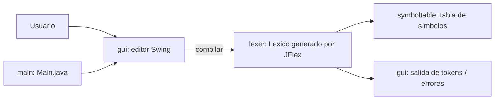

# Arquitectura del proyecto

Qué hace cada componente y cómo se relacionan. Complementa al resumen del README.

> Estado kickstart: los paquetes `gui` y `symboltable` están vacíos a propósito
> (solo contienen `.gitkeep`) y se completan durante el desarrollo del TP.

## Vista general

Aplicación de escritorio (Swing) que funciona como IDE del compilador: el usuario
escribe o carga código fuente, el analizador léxico (generado por JFlex) lo
tokeniza y la GUI muestra los tokens reconocidos o los errores; la tabla de
símbolos guarda variables y constantes con sus atributos (NOMBRE, TOKEN, TIPO,
VALOR, LONG, según la consigna).

## Paquetes (organización por capa)

### `unlu.teoi.grupo5.main`
- `Main.java`: punto de entrada de la aplicación. Instancia la GUI.
- Hoy es un placeholder que abre una ventana vacía (valida el JAR ejecutable).

### `unlu.teoi.grupo5.lexer`
- La especificación léxica `Lexico.flex` vive físicamente en `src/main/jflex/`.
- En build, JFlex genera `Lexico.java` en
  `target/generated-sources/jflex/unlu/teoi/grupo5/lexer/` con
  `package unlu.teoi.grupo5.lexer`. Ese archivo **no se versiona ni se edita**.
- El paquete alojará el código de soporte escrito a mano (clases de token,
  excepciones, constantes del léxico, etc.).

### `unlu.teoi.grupo5.gui`
- Interfaz Swing del IDE: `JTextArea` para el código fuente, botones para
  cargar archivo y compilar, panel de salida para tokens y errores.
- Regla de la consigna: los elementos que no generan token no deben producir
  salida; las impresiones deben ser claras.

### `unlu.teoi.grupo5.symboltable`
- Tabla de símbolos con inserción y consulta. Guarda variables y constantes con
  sus atributos (NOMBRE, TOKEN, TIPO, VALOR, LONG), según el formato de `ts.txt`.
- Las constantes guardan su valor; las variables no (ver consigna).

## Pipeline de build

1. `generate-sources` — `jflex-maven-plugin` lee `src/main/jflex/Lexico.flex` y
   genera `Lexico.java`; `build-helper-maven-plugin` agrega esa carpeta como
   raíz de fuentes.
2. `compile` — `maven-compiler-plugin` compila `src/main/java` + fuentes
   generadas con `release 17`.
3. `test` — `maven-surefire-plugin` ejecuta los tests JUnit 5 de `src/test/java`.
4. `package` — `maven-shade-plugin` arma un JAR único ejecutable con
   `Main-Class: unlu.teoi.grupo5.main.Main`.

Todo lo generado vive en `target/` y está gitignored.

## Integración continua

`.github/workflows/build.yml` ejecuta `./mvnw -B verify` con JDK 17 (Temurin)
en cada `push` y `pull_request` sobre `main` y `develop`.

## Archivos de entrega

| Archivo | Ubicación | Rol |
|---|---|---|
| `Lexico.flex` | `src/main/jflex/` | especificación léxica (lo procesa el build) |
| `prueba.txt` | `docs/entrega1/` | pruebas generales + prueba del tema SUMAIMPAR |
| `ts.txt` | `docs/entrega1/` | tabla de símbolos |
| JAR ejecutable | `target/teoi-grupo5-1.0-SNAPSHOT.jar` | generado con `./mvnw package`, no versionado |
